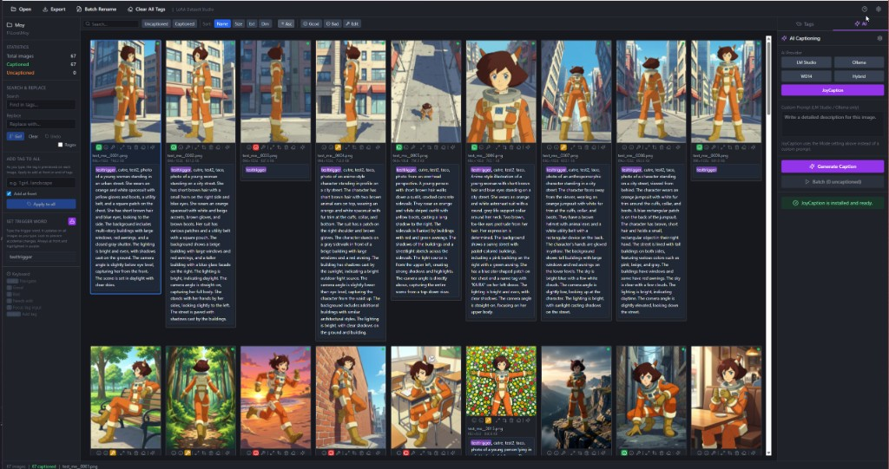

# LoRA Dataset Studio

A modern, cross-platform desktop application for preparing image datasets for AI model training (LoRA, DreamBooth, Textual Inversion, etc.). Built to make tagging and captioning thousands of images fast and enjoyable.




## Features

### Image Management
- **Responsive Grid View** — Auto-fills the window; resize to see more or fewer columns
- **Rating System** — Mark images as Good, Bad, or Needs Edit (keyboard: 1, 2, 3)
- **Multi-Select** — Ctrl+Click to select multiple images for batch operations
- **Image Preview** — Double-click or Enter to view full-size image with zoom
- **Crop** — Interactive crop with aspect presets, rotate, flip; optionally save as new image
- **Delete** — Remove image and its caption file from the folder (with confirmation)
- **Sort** — By name, size, extension, or dimensions; ascending/descending
- **Loading Progress** — Visual overlay when scanning large folders

### Tag Editing
- **Inline Editing** — Click caption area under any image to edit tags
- **Right Panel Editor** — Tag list with drag-to-reorder and quick delete
- **Search & Replace** — Find and replace across all tags with regex support
- **Live Highlighting** — Matches highlighted as you type
- **Trigger Word** — Set a trigger word; kept first in all tags, with optional lock
- **Add Tag to All** — Add a tag to every image (front or end), with live preview
- **Clear Tags** — Per-image "clear all tags" (with optional confirm) and toolbar "Clear All Tags" (type "delete" to confirm)
- **Auto-Save** — Changes saved to `.txt` caption files
- **Undo/Redo** — Ctrl+Z / Ctrl+Y for tag changes

### AI Captioning
- **LM Studio** — Connect to local LM Studio; any vision model; custom prompts and templates
- **Ollama** — Same OpenAI-compatible API; use `llava` or other vision models locally
- **JoyCaption** — One-click installer; LLaVA-based model; modes: Descriptive, Booru
- **WD14** — Danbooru-style tags via a user-provided Python script (`--image` + stdout tags)
- **Hybrid** — WD14 tags + JoyCaption description merged for "best of both"
- **Batch** — One model load per batch for JoyCaption; parallel requests for LM Studio/Ollama; WD14/Hybrid one-by-one
- **Stop** — Cancel batch captioning mid-run; progress is kept up to the current chunk
- **Per-Image** — Generate caption from the grid or from the AI panel with preview
- **Preview before save** — Optional setting: grid Generate shows Accept/Reject before overwriting

### Filtering & Navigation
- **Search** — Filter by filename or tag content
- **Caption Status** — Show only captioned or uncaptioned
- **Rating Filter** — Filter by Good, Bad, or Needs Edit
- **Keyboard** — Arrow keys, Home/End, Enter to preview, Escape to close, +/- to zoom

### Export
- **Export Wizard** — Export to folder or ZIP
- **Export by Rating** — Copy into `good/`, `bad/`, `needs_edit/` subfolders
- **Options** — Trigger word, sequential naming, only captioned

## Tech Stack

- **Desktop:** [Tauri 2](https://v2.tauri.app/) (Rust backend, native webview)
- **Frontend:** React 18, TypeScript, [Vite](https://vitejs.dev/)
- **State:** [Zustand](https://github.com/pmndrs/zustand) (persist) + [TanStack Query](https://tanstack.com/query/latest)
- **Styling:** Tailwind CSS, dark theme
- **Icons:** [Lucide React](https://lucide.dev/)

## Prerequisites

- [Node.js](https://nodejs.org/) 18+ and npm
- [Rust](https://rustup.rs/) (latest stable)
- [Tauri prerequisites](https://v2.tauri.app/start/prerequisites/) for your OS:
  - **Windows:** WebView2 (usually pre-installed on Windows 10/11), [Visual Studio Build Tools](https://visualstudio.microsoft.com/downloads/#build-tools-for-visual-studio-2022) with C++ workload
  - **macOS:** Xcode Command Line Tools (`xcode-select --install`)
  - **Linux:** See [Tauri Linux prerequisites](https://v2.tauri.app/start/prerequisites/#linux)

For JoyCaption: Python 3.10+ (auto-installer available in the app). CUDA GPU recommended for faster captioning.

## Installation

### 1. Clone the repository

```bash
git clone https://github.com/Fablestarexpanse/Joycaption_Mobile_LoRa_Organizer.git
cd Joycaption_Mobile_LoRa_Organizer
```

### 2. Install dependencies

```bash
npm install
```

This installs all Node.js dependencies for the frontend and the Tauri CLI.

### 3. Run in development mode

```bash
npm run tauri dev
```

The first Rust build can take 5–10 minutes. Subsequent runs are much faster (incremental compilation).

The app window will open automatically when the build completes.

### 4. Build for production (optional)

```bash
npm run tauri build
```

Installers will be created in `src-tauri/target/release/bundle/` for your platform:
- **Windows:** `.msi` or `.exe` installer
- **macOS:** `.dmg` or `.app` bundle
- **Linux:** `.deb`, `.AppImage`, or other formats depending on your config

## Usage

1. **Open a folder** — Click "Open" in the toolbar and select a folder containing images
2. **Edit tags** — Click the caption area under any image to edit tags inline, or use the right panel editor
3. **AI captioning** — Select an AI provider (LM Studio, Ollama, WD14, Hybrid, or JoyCaption), configure settings, then click "Generate" (single image) or "Batch" (multiple images)
4. **Filter & Sort** — Use the filter bar to search by filename or tags, filter by caption status or rating, and sort images
5. **Export** — Click "Export" to save your dataset to a folder or ZIP file, with options for trigger words, sequential naming, and rating-based organization

### Keyboard Shortcuts

| Action                          | Shortcut                    |
|---------------------------------|-----------------------------|
| Navigate image grid             | Arrow keys (←→↑↓)           |
| Jump to first / last image      | Home / End                  |
| Multi-select images             | Ctrl+Click                  |
| Open image in preview           | Enter / Double-click        |
| Close preview or modal          | Escape                      |
| Zoom in / out (in preview)      | + / −                       |
| Previous / next (in preview)    | ← / →                       |
| Focus tag input                 | T                           |
| Add tag (when input focused)    | Enter                       |
| Undo last tag change            | Ctrl+Z                      |
| Redo                            | Ctrl+Y / Ctrl+Shift+Z       |
| Generate AI caption             | Ctrl+G (when image selected)|
| Show help                       | ?                           |

## Project Structure

```
├── src/                 # React frontend
│   ├── components/      # ai, editor, grid, layout, preview, export, etc.
│   ├── hooks/           # useProject, useFocusTrap
│   ├── stores/          # Zustand (ai, filter, selection, settings, …)
│   ├── lib/             # Tauri API (tauri.ts)
│   └── types/           # TypeScript types
├── src-tauri/
│   ├── src/commands/    # Rust: captions, images, lm_studio, ollama, joycaption, export, …
│   └── resources/       # joycaption_inference.py
└── docs/
```

## Caption Format

One `.txt` file per image with the same base name; comma-separated tags (Kohya/OneTrainer compatible):

```
image001.png
image001.txt  → "trigger_word, tag1, tag2, description"
```

## AI Integration

### LM Studio
1. Download and run [LM Studio](https://lmstudio.ai/)
2. Load a vision model (e.g., LLaVA, BakLLaVA, or any multimodal model)
3. Start the local server (default: http://localhost:1234)
4. In the app: **AI provider → LM Studio → Settings → Test** → pick model → **Generate**

### Ollama
1. Install [Ollama](https://ollama.com/)
2. Pull a vision model: `ollama pull llava` (or another vision model)
3. In the app: **AI provider → Ollama → Settings → Test** (default: http://localhost:11434/v1) → pick model → **Generate**

### JoyCaption
1. In the app: **AI provider → JoyCaption → Install JoyCaption** (one-click venv + model download)
2. Choose mode (Descriptive or Booru) → **Generate** or **Batch**

### WD14
1. Obtain a WD14 tagger script that accepts `--image <path>` and prints comma-separated tags to stdout
   - Example: [wd14-tagger-standalone](https://github.com/toriato/wd14-tagger-standalone) or scripts from [kohya_ss](https://github.com/kohya-ss/sd-scripts)
2. In the app: **AI provider → WD14 → Settings** → set Python path and script path → **Generate** or **Batch**

### Hybrid (WD14 + JoyCaption)
1. Set up both WD14 script and JoyCaption (as above)
2. In the app: **AI provider → Hybrid → Settings** → configure WD14 script path and JoyCaption Python/script/mode → **Generate** or **Batch**
3. Output is WD14 tags plus JoyCaption description merged

### Preview before save (grid Generate)
Go to **Settings → General → Preview AI caption before saving (grid Generate)**. When enabled, generating from the grid shows a preview so you can Accept or Reject before overwriting existing tags.

## Contributing

Contributions are welcome! Please open an issue or pull request on GitHub.

## License

MIT — see [LICENSE](LICENSE).

## Acknowledgments

- [Tauri](https://tauri.app/) for the desktop framework
- [JoyCaption](https://huggingface.co/John6666/llama-joycaption-beta-one-hf-llava-nf4) for the captioning model
- The LoRA and diffusion training community
